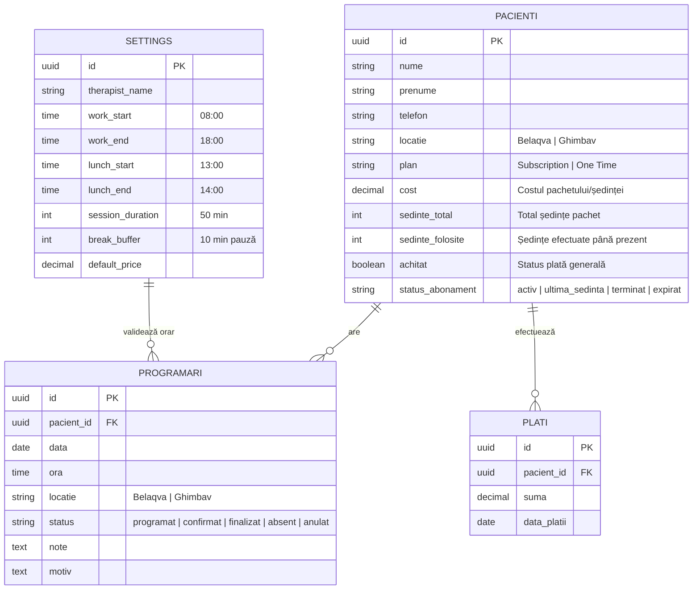
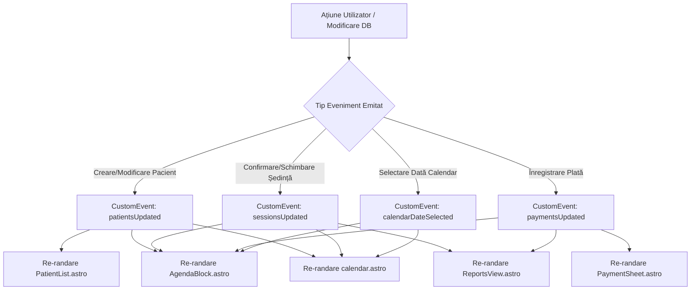

# 📐 Arhitectura și Logica Aplicației Kineto Dashboard

Acest document descrie în detaliu **arhitectura sistemului**, **baza de date Supabase**, **logica de business** și **comunicarea event-driven** dintre backend și frontend pentru aplicația **Kineto Dashboard**.

---

## 1. 🗄️ Modelul de Date & Schema Postgres (Supabase)

Aplicația este construită peste o bază de date relațională Postgres în Supabase, securizată prin **Row Level Security (RLS)**.

---

## 2. 🔄 Logica de Business & Fluxurile de Lucru

### 2.1. Pauza de Masă și Sloturile Orare (50 min ședință + 10 min pauză)
- Aplicația generează sloturile din calendar conform configurării din `settings`.
- Fiecare slot durează 50 de minute urmat de o pauză buffer de 10 minute.
- Intervalul configurat pentru pauza de masă (ex. `13:00 - 14:00`) este rezervat automat ca banner vizual interzis programărilor.

### 2.2. Programare Nouă (`AddSessionSheet.astro`)
1. Când terapeutul apasă pe un slot orar liber sau pe butonul `+ Adaugă ședință`, se emite evenimentul custom `openAddSession` transmis cu data și ora selectată.
2. Dacă este creat un pacient nou *inline* sau dacă un pacient existent își mărește pachetul (ex. de la 1 la 10 ședințe), baza de date se actualizează **înainte** de inserarea programării în tabela `programari`.
3. După crearea programării, starea implicită este **`programat`**.

### 2.3. Confirmarea Ședinței & Wrap-Up (`SessionWrapUpSheet.astro`)
1. Apăsarea butonului **`CONFIRMĂ ȘEDINȚA`** deschide modalul de finalizare (Wrap-Up).
2. Când terapeutul confirmă ședința:
   - Starea programării din `programari` devine **`finalizat`**.
   - Câmpul `sedinte_folosite` de pe pacient este incrementat cu **+1** direct în tabela `pacienti` (și sincronizat via trigger SQL `trg_incrementeaza_sedinte`).
   - Opțional, se poate programa automat ședința pentru săptămâna viitoare la aceeași oră.

### 2.4. Reînnoire Pachet / Resetare de la 0 (`resetPatientSubscription`)
- Când un pacient a consumat toate ședințele (`sedinte_folosite >= sedinte_total`), pe cardul său apare butonul roz:  
  **`ABONAMENT TERMINAT — REÎNNOIEȘTE (0/N)`**
- La apăsarea butonului, funcția `resetPatientSubscription(patientId, newTotal)`:
  - Setează `sedinte_folosite = 0`.
  - Setează `status_abonament = 'activ'`.
  - Setează noul `sedinte_total` (ex. 10 sau 1).
  - Emite `patientsUpdated` și `sessionsUpdated` pentru re-randare instantă.

### 2.5. Calculul Statusului de Plată Per Ședință
- **Pentru ședința de AZI (sau trecute):** Dacă suma încasată acoperă costul ședinței sau dacă `achitat = true`, cardul afișează **Achitat**.
- **Pentru ședința de MÂINE (viitoare):** Dacă pachetul nu a fost pre-plătit integral, cardul afișează **Neachitat**, permițând diferențierea clară între ziua curentă și zilele viitoare.

### 2.6. Sincronizarea Statisticilor și Rapoartelor (`reportsService.ts`)
- **Ședințe efectuate:** Numără **exclusiv** programările confirmate (`status IN ('finalizat', 'finalizata')`).
- **Venituri:** Însumează plățile reale înregistrate în tabela `plati`, având ca fallback costul ședințelor confirmate dacă nu există o intrare separată de plată.

---

## 3. ⚡ Arhitectura Event-Driven (Sincronizare Frontend în Timp Real)

Aplicația folosește un sistem de **Custom DOM Events** pentru a asigura sincronizarea instantanee între toate componentele fără a necesita refresh manual (`F5`):

---

## 4. 🛠️ Utilitare de Fus Orar & Siguranță Date (`src/utils/date.ts`)

- **Formate ISO Locale:** Pentru a preveni decalajele de fus orar (UTC shift bug la miezul nopții), toate convertirile de date folosesc `toLocalISOString(date)`.
- **Polyfill Nativ `Date.prototype.toLocalISOString`:** Garantează că orice apelare (ca funcție standalone sau ca metodă pe obiectul `Date`) se execută fără erori `TypeError`.

---

## 5. 🎨 Design System & Aspect Vizual
- **Pachete de culori:**
  - Card Ghimbav (`isGhimbav = true`): Fundal Galben (`bg-brand-primary`), progres galben.
  - Card Belaqva (`isGhimbav = false`): Fundal Alb/Roz, progres roz (`bg-brand-secondary`).
- **Bannere de avertizare:** Text negru aliniat pe fundal roz cu lizibilitate și contrast maxim.
